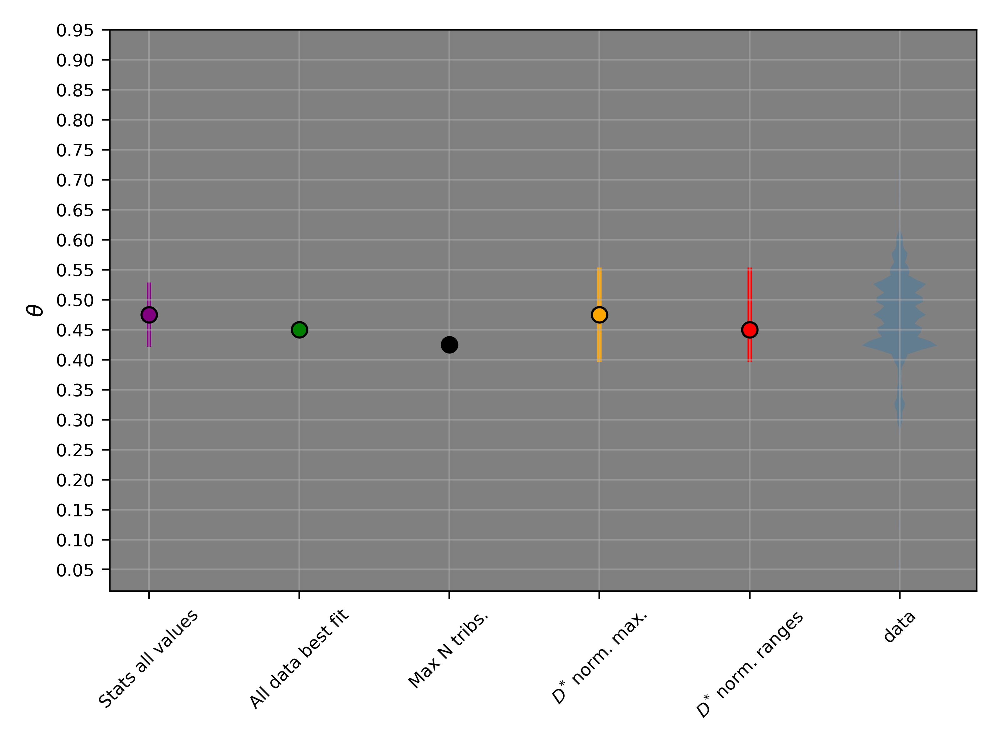
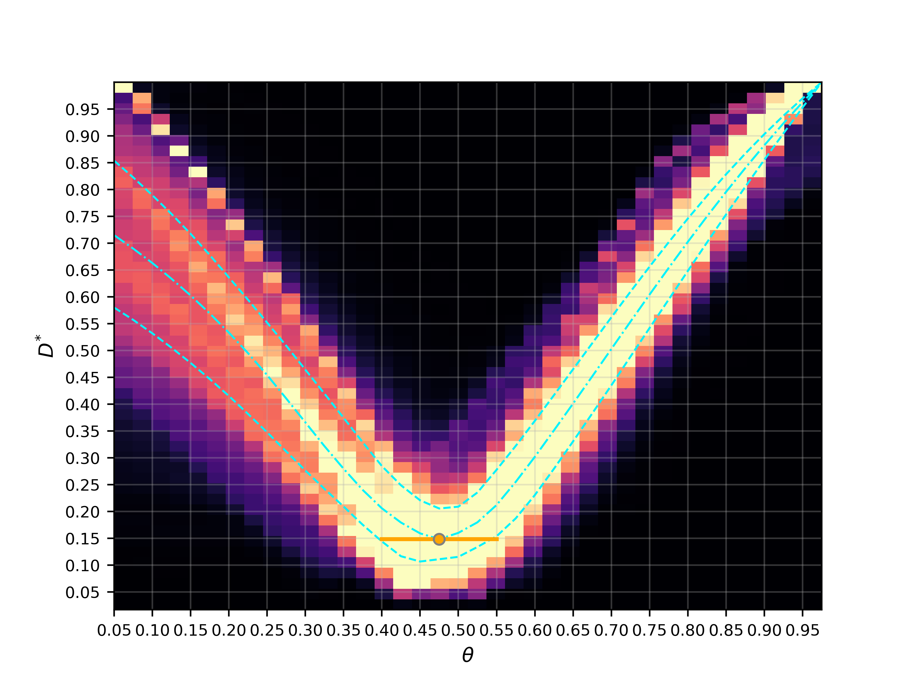
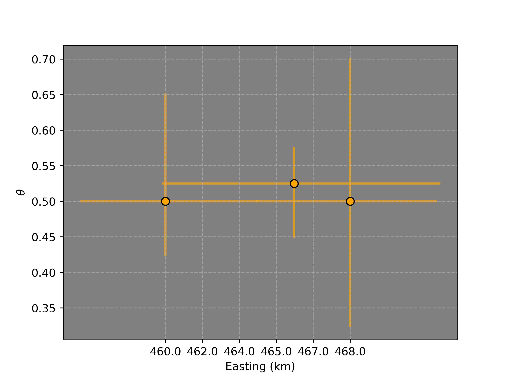
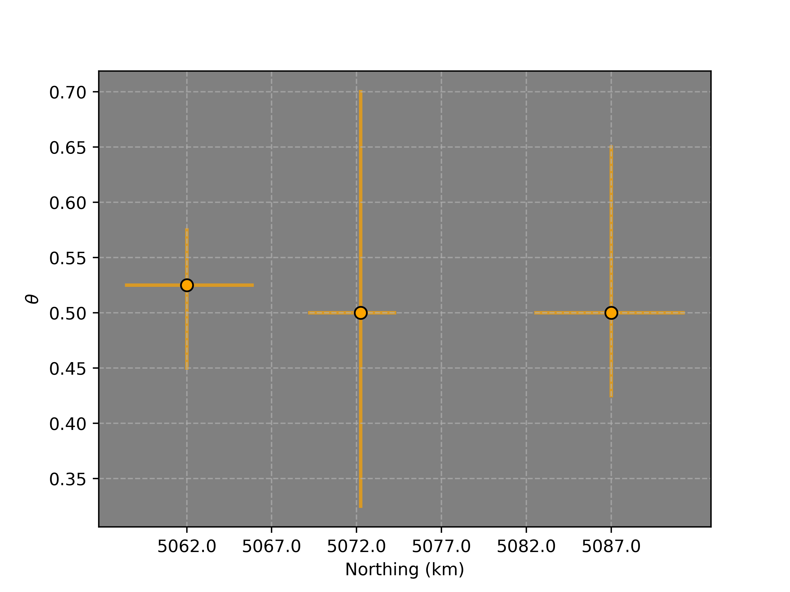
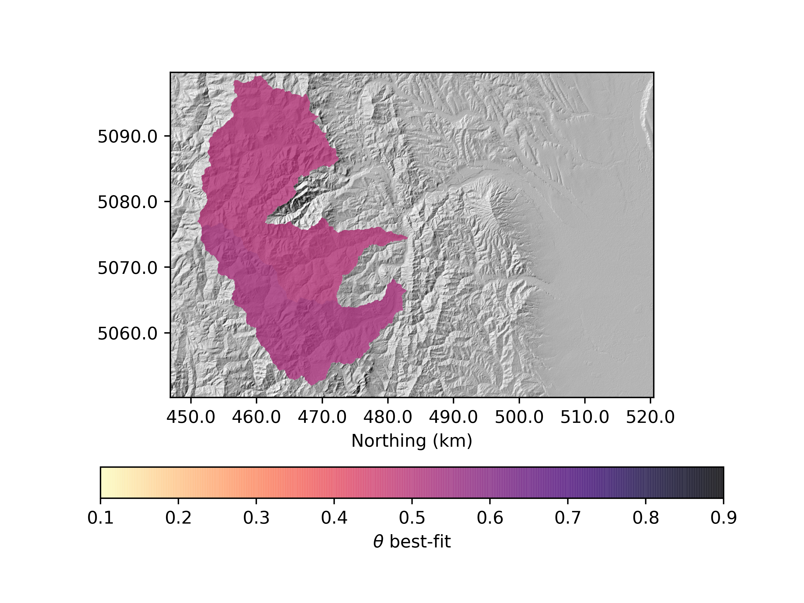

= Using the code for concFFS paper
Boris Gailleton <b.gailleton@sms.ed.ac.uk>

== Code and installation

Source code can be found in my `LSDTT_development` folder (`src/driver_analysis_BG/`), where `lsdtt_xtensor_python` contains the `cpp` wrapper communicating between `python` and `cpp` through the class `LSDDEM_xtensor` and `lsdtopytools` contains all the python code directing it.

I made command line tools so you do not need to dig through that code (I am slowly but carefully documenting it. It (i) runs the analysis, (ii) provides basic plotting and (iii) produce easily readable files for making customisable figures.

=== Installation and update

Installation and update guide can be found https://github.com/LSDtopotools/lsdtopytools[here], I will update the code through that platform. Installation on a server may be tricky if there is no `conda` or `pip` possibilities, but I can craft something if this is the case. I tested the code on several linux and windows 10.

== Quick start

The next section details the use of the software via commandline tool. For a quick start to use concavity, the following workflow is recommended. (I assume your raster is downloaded and in UTM).

[source]
----
# Remove seas that can slow the carving algorithm a lot, also fixed pernicious nodata
lsdtt-remove-seas file=myraster.tif sea_level=0
# Fill/carve depressions
lsdtt-depressions file=myraster_seas_removed.tif fill breach min_slope=0.00001
# Pick outlets, spawn a list of csv files openable in QGIS (XY in UTM) to check if the basin extent is satisfying
lsdtt-concFFS-spawn-outlets file=myraster_seas_removed_PP.tif already_preprocessed test_edges min_DA=1e7 max_DA=1e9 area_threshold=3500 prefix=TEST
# Run the analysis, be careful with the number of processor you want to use. I run on the server So I use 24
lsdtt-concFFS-multiple file=myraster_seas_removed_PP.tif already_preprocessed csv=TESToutlets.csv prefix=TEST mode=g n_proc=4
# Plot the analysis (can be done coevally with generating the result with mode=gp)
lsdtt-concFFS-multiple file=myraster_seas_removed_PP.tif already_preprocessed csv=TESToutlets.csv prefix=TEST mode=p
# OPTIONAL AND TIME-CONSUMING, plot all the D* maps
lsdtt-concFFS-multiple file=myraster_seas_removed_PP.tif already_preprocessed csv=TESToutlets.csv prefix=TEST mode=d

----

== Command-line usage

Once installed, command line tools are available to run the code. I ran into many bugs with `argparse` package and ran out of time to fix it, I therefore coded a quick python parser: boolean arguments are single words to switch to `True` (_e.g._ `already_preprocessed`); float, string and int are adjoined with their argnames *WITHOUT* spaces (_e.g._ `X_outlet=32445.8`) and so does the lists using commas as separator (_e.g._ `X_outlets=32445.8,443545.6,3242355.6`).

Most of the analysis have a help statement containing a copyable example to adapt and circumvent the lack of auto-completion for some terminals.

If needed, the code managing the concavity command-line tools are in `scripts_for_lsdtopytools/lsdtt_concavity_tools.py` and `lsdtopytools/concavity_automator.py`, as I am near the end of my PhD they are not the clearest codes to read unfortunately, look at `lsdtopytools.py` for better examples.

=== Raster pre-manipulations

I recommend to preprocessed the raster beforehand to save time. You can remove seas with:

[source]
----
lsdtt-remove-seas file=myraster.tif sea_level=0
----

Note that if your raster has some dodgy no-data, carving algorithm might take an unnecessary longer time.

Preprocessing the depressions with filling and carving (named breach for some reasons) available:

[source]
----
lsdtt-depressions file=myraster.tif fill breach min_slope=0.00001
----

[NOTE]
====
Outputs are created either in the same folder than the DEM, or its eponymous folder. This can be a bit of a mess but I am working on it.
====

=== Running analysis for a single watershed

This analysis runs the code for a single watershed identified by the X and Y coordinates of the outlet in map units. So far it needs to be within the exact pixel (I recommend using QGIS to do so). The help statement is the best way to describe it actually:

[source]
----
Command-line tool to constrain concavity for a single basin from its XY coordinates using Normalised disorder method.
Takes several arguments (the values after = are example values to adapt):
file=NameOfFile.tif -> The code NEEDS the neame of the raster to process.
already_preprocessed -> OPTIONAL Tell the code your raster does not need preprocessing, otherwise carve the DEM (see lsdtt-depressions for more options)
X=234 -> X Coordinate (in map unit) of the outlet (needs to be the exact pixel at the moment, will add a snapping option later)
Y=234 -> Y Coordinate (in map unit) of the outlet (needs to be the exact pixel at the moment, will add a snapping option later)
AT=5000 -> Area threshold in number of pixel to initiate a river: lower nummber <=> denser network (quickly increases the processing time)
prefix=test -> OPTIONAL Add a prefix to each outputted file (handy for automation)
mode=g -> DEFAULT is g . Processing mode: can be "g" for generating data, "p" or plotting previously generated data or "all" for everything.

Example:

lsdtt-concFFS-single file=DEM.tif already_preprocessed X=43422 Y=5353497 AT=2500 prefix=FeatherRiver mode=all
----

[NOTE]
====
Code is ready to snap to nearest channel point but I need a bit of time to implement it in the command line tool sorry. Same for lat/lon conversion (by experience, any snapping involves significant playing with XY coordinates before reaching the attended results, which is not compatible with automation).
====

The results, if plotted:

[#Summary]
[caption="Summary plot of the different methods: Stats all values = disorder with uncert. (Mudd et al., 2018); All data best-fit = disorder (Mudd et al., 2018); Max N. tribs: concavity that fitted the maximum number of combination tested; D* norm max is normalised by maximum, D* orm. range is normalised to the range and data are all te best fits."]

[#Disorder_star_single]
[caption="D* for the watershed, with the best fit and error displayed."]

=== Running analysis for a multiple watersheds

Running the analysis for multiple watershed works as follow:

. It reads a `csv` file with all the basin outlets. The `csv` needs a column `X`, a column `Y` and a column `area_threshold`. This outlet file can be manually created or automatically with other comand-line tools described in the next subsection.
. It automatically splits out rasters for each basins
. It independently processes these raster (potentially with multiple parallel processes), and output a number of files
. As processing the data can be very long, the same command-line can be used jsut to plot the results without regenerating the data.

[source]
----
Command-line tool to constrain concavity for a multiple basin from their XY coordinates using Normalised disorder method.
Takes several arguments (the values after = are example values to adapt):
file=NameOfFile.tif -> The code NEEDS the neame of the raster to process.
already_preprocessed -> OPTIONAL Tell the code your raster does not need preprocessing, otherwise carve the DEM (see lsdtt-depressions for more options)
csv=outlets.csv -> Name of the csv file containing the following columns: "X", "Y" and "area_threshold" for each basins to investigate. Can be generated automatically from lsdtt-concFFS-spawn-outlets
n_proc=4 -> DEFAULT is 1. Number of processors to use in parallel when possible.
prefix=test -> OPTIONAL Add a prefix to each outputted file (handy for automation)
mode=g -> DEFAULT is g . Processing mode: can be "g" for generating data, "p" or plotting previously generated data, "d" for plotting disorder map (WARNING takes time and memory) "all" for everything.

Example:

lsdtt-concFFS-multiple file=DEM.tif already_preprocessed csv=FeatherRiveroutlets.csv prefix=FeatherRiver mode=g
----

The plotting outputs the result of all the watersheds by their Easting, Northing, a map colored by best-fits and if requested (takes time and memory), a map of Normalised Disorder for each thetas.

=== Preselecting the watersheds

There are (so far) two main ways to preselect watersheds. They produce an outlet csv file directly ingestible by `lsdtt-concFFS-multiple` and a perimeter csv file to quickly visualise it on QGIS.

The first routine selects basins based on their size:

[source]
----
Command-line tool to prechoose the basins used for other analysis. Outputs a file with outlet coordinates readable from other command-line tools and a basin perimeter csv readable by GISs to if the basins corresponds to your needs.
Takes several arguments (the values after = are example values to adapt):
file=NameOfFile.tif -> The code NEEDS the neame of the raster to process.
already_preprocessed -> OPTIONAL Tell the code your raster does not need preprocessing, otherwise carve the DEM (see lsdtt-depressions for more options)
test_edges -> OPTIONAL will test if the basin extracted are potentially influenced by nodata and threfore uncomplete. WARNING, will take out ANY basin potentially cut, if you know what you are doing, you can turn off.
prefix=test -> OPTIONAL Add a prefix to each outputted file (handy for automation)
method=from_range -> DEFAULT from_range: determine the method to select basin. Can be
		from_range -> select largest basins bigger than min_DA but smaller than max_DA (in m^2)
		min_area -> select largest basins bigger than min_DA
		main_basin -> select the largest basin
		Other methods to come.
min_elevation=45 -> DEFAULT 0. Ignore any basin bellow that elevation
area_threshold=3500 -> DEFAULT 5000. River network area threshold in number of pixels (part of the basin selection is based on river junctions HIGHLY sensitive to that variable).

Example:
lsdtt-concFFS-spawn-outlets file=DEM.tif already_preprocessed min_DA=1e7 max_DA=1e9 area_threshold=3500
----

And the other one select sub-basins within a main one:

[source]
----
Command-line tool to extract basin information about all the subbasins within a main one. Outputs a file with outlet coordinates readable from other command-line tools and a basin perimeter csv readable by GISs to if the basins corresponds to your needs.
Takes several arguments (the values after = are example values to adapt):
file=NameOfFile.tif -> The code NEEDS the neame of the raster to process.
already_preprocessed -> OPTIONAL Tell the code your raster does not need preprocessing, otherwise carve the DEM (see lsdtt-depressions for more options)
prefix=test -> OPTIONAL Add a prefix to each outputted file (handy for automation)
min_elevation=45 -> DEFAULT 0. Ignore any basin bellow that elevation
area_threshold=3500 -> DEFAULT 5000. River network area threshold in number of pixels (part of the basin selection is based on river junctions HIGHLY sensitive to that variable).
min_DA=1e7 -> minimum drainage area to extract a subbasin
max_DA=1e9 -> maximum drainage area for a subbasin
X=234 -> X Coordinate (in map unit) of the outlet (needs to be the exact pixel at the moment, will add a snapping option later)
Y=234 -> Y Coordinate (in map unit) of the outlet (needs to be the exact pixel at the moment, will add a snapping option later)

Example:
lsdtt-concFFS-spawn-outlets file=DEM.tif already_preprocessed min_DA=1e7 max_DA=1e9 area_threshold=3500
----

[NOTE]
====
LSDTopoTools basin selection is based on junction location and is therefore very sensitive to area-threshold and topography. This is the reason I coded new routines to select basin by outlet nodes and then wrap it on the junction network ones. Let me know if you find a bug in that.
====

== Customisable plotting

If you want to produce your own plotting, here is the description of the outputs for each analysis.

- `X_concavity_tot.npy`: loadable with `np.load()`, it contains a 1D array with all the best-fits for each combinations tested by the software for that watershed (Disorder_with_uncert drom Mudd et al, 2018).
- `X_singletest_disorder_normaliser.npy`: DEPRECATED, I am keeping it for test but it contains the number of pixels for each combinations
- `X_singletest_disorder_tot.npy`: most important file, 2D numpy array of dimansion (combinations,tested_thetas). It contains ALL the disorder values for each theta tested for each combinations. I made heavy use of numpy axis wide stats to calculate the D* and its associated best-fit (median by column, and np.argmin).
- `X_singletest_overall_test.feather`: pandas dataframe with two column `overall_disorder` and `tested_movern`. The overall disorder is the disorder encompassing all points in the watershed (disorder sensu Mudd et al., 2018).
- `X_XY.feather`: padans dataframe with all the XY of the points within the basins. Used to speed up some IO and facilitate some processing.
- `X_rivers.feather`: the river network.

[NOTE]
====
`feather` files are used because of their *INCREDIBLE* performance and memory usage over csv files. However they are not readable by humans, you can use `lsdtt-csv-conversion mode=feather2csv all extension=.feather` to convert all feather files of a folder to csv.
====

== Python tools

All of these tools are based on `python` code (new) controlling the `cpp` codes (mostly untouched from LSDTopoTools). I did not developed these just for fun, but because:

. Developing new drivers is dead easy and straightforward, for general or specific use,
. It allows the use of other python packages to process the results (e.g. scipy) and avoid loosing time recoding widely used algorithms,
. Makes the I/O very easy: read/write tif, asc, bil, csv, feather, netCDF, hdf5, _etc._
. Can run on any Os though a conda environment
. Plotting is better integrated within the same tool set.

Example on running sensitivity analysis on `target_node` parameters:

[source,python]
----
# The following lines import the module we will use. Any python scripts starts with importing other bits of codes we need
from lsdtopytools import LSDDEM # I am telling python I will need this module to run.
import numpy as np

# You can add any extra dependencies you need here. For example pandas, numpy or matplotlib.

# First step is to load the DEM
## The name "mydem" can be changed into whatever suits you
## Let's have a clean and organised approach and save things into variables
path_to_dem = "/adapt/here/the/path/to/your/dem/" # You need to obviously adapt that path to your case
dem_name = "whatever_name.tif" # You also need to adapt that file name...
## Now we can load the dem into LSDTopytools:
### already_preprocessed can be turn to True if you are 100% sure that your dem does not need preprocessing before flow routines
mydem = LSDDEM(path = path_to_dem, file_name = dem_name, already_preprocessed = False)

# Alright the dem is in the system and now needs to be preprocessed (if not done yet)
mydem.PreProcessing(filling = True, carving = True, minimum_slope_for_filling = 0.0001) # Unecessary if already preprocessed of course.

#Need to pregenerate a number of routines, it calculates flow direction, flow accumulation, drainage area , ...
mydem.CommonFlowRoutines()

# This define the river network, it is required to actually calculate other metrics
mydem.ExtractRiverNetwork( method = "area_threshold", area_threshold_min = 1500)

# Defining catchment of interest: it extracts the catchments by outlet coordinates. You also need to adpat these obviously!!
## they need to be in the same coordinate system than the raster.
mydem.DefineCatchment( method="from_XY", X_coords = [532297,521028], Y_coords = [6188085,6196305])

for target_node in np.arange(10,90,10):
	# Calculates chi coordinate with an according theta
	mydem.GenerateChi(theta = 0.35, A_0 = 1)
	mydem.ksn_MuddEtAl2014(target_nodes=target_node, n_iterations=60, skip=1)
	mydem.df_ksn.to_csv("ksn_tg_%s.csv"%(target_node), index = False) #  This saves the base rivers to csv

----

I am happy to provide example script rather than command line tools if needed for particular cases.
